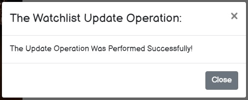

# project3_binger
Binger Watch List

## Summary
An application that allows you to add all of the movies and TV shows you want to watch from all platforms to one "watchlist". Instead of having to open every streaming app to see what you want to watch, just log on to Binger to see what you have saved to your watchlist to make that decision easier. Mark the shows/movies off as you watch, rate and review! 

## Table of Contents
-[User Story](#user-story)

-[Acceptance Criteria](#acceptance-criteria)

-[Installation](#installation)

-[License](#license)

-[Contributing](#contributing)

-[User Interface Operations](#userinterface)

-[Links](#links)

## User Story 
As a TV/Movie buff,
I want to be able to keep a list of shows and movies I want to watch in one locations, so that I don't have to search through multiple platforms. 

## Acceptance Criteria 
* Use React for the front end.

* Use GraphQL with a Node.js and Express.js server.

* Use MongoDB and the Mongoose ODM for the database.

* Use queries and mutations for retrieving, adding, updating, and deleting data.

* Be deployed using Heroku (with data).

* Have a polished UI.

* Be responsive.

* Be interactive (i.e., accept and respond to user input).

* Include authentication (JWT).

* Protect sensitive API key information on the server.

* Have a clean repository that meets quality coding standards (file structure, naming conventions, best practices for class and id naming conventions, indentation, high-quality comments, etc.).

* Have a high-quality README (with unique name, description, technologies used, screenshot, and link to deployed application).

## Installation 
The user should clone the repository from Github and run "npm run start" in the integrated terminal. 

## License 
This project has no license. Please feel free to use our code as a reference!

## Contributing 
Brianna Pappas 
Duane Cantera 
Robert Augusta

## User Interface Operations 

 

### Home Page Performs The Search Operation:
The user can search for TV Shows or Movies.
 

  

### Cannot Save To Watchlist If Not Logged In:
The user can view search results but cannot perform the "Save to watchlist" Operation.
 

  

### Perform The Login & Sign Up Operations:
The user can select the Login or Sign Up Operations.
 

  

### User Can Add TV Show Or Movie To Watchlist:
After Logging In the user can selet the "Save to watchlist" Option.
 

  

### Watchlist Item Changes After Being Saved:
The user told item was saved to the watchlist.
 

  

### The User Can View Saved Watchlist items.  Delete A Watchlist Item.  Add A Review, Rating Or Set The Watched Option By Selecting the "Update Watchlist" Option:
 

  

### User Prompted With Update Message":
The user is told the update operation was performed successfully.
 

  

### Perform Logout Operation:
The user can selet the Logout Option.
 

  

## Links 
Github: https://github.com/bripap/project3_binger
Heroku: https://fast-spire-33586.herokuapp.com/